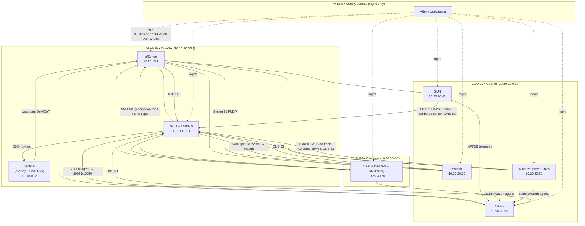
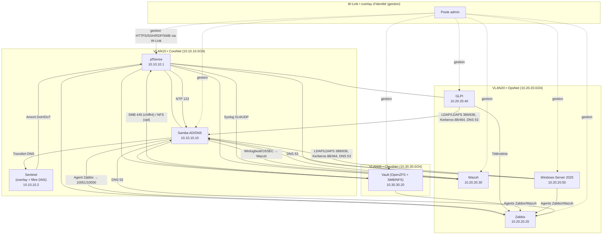

# ⚡🐋 OrcaZ — Zero-Trust Lab Infrastructure

    
    

---

## 🇺🇸 ⚡🐋

### 1) Overview 🚀

**OrcaZ** is a compact, exam‑ready lab: **VLAN‑segmented**, **identity‑first**, and **observable**. To keep the virtual host light, two core roles run on **dedicated bare‑metal Linux** (names intentionally hidden):

* **Vault** — storage: **OpenZFS + Samba/NFS** (files, backups, snapshots).
* **Sentinel** — control: **Headscale** (identity overlay) + **Pi-hole** (DNS filter).
* **Virtualized** — **pfSense**, **Samba AD/DNS**, **Zabbix**, **Wazuh**, **GLPI**, **Windows Server 2025** (exam requirement).

> Remote administration is referenced only by the coded label **W-Link**.

**Stack (official docs)**
Arch Linux — [https://wiki.archlinux.org/](https://wiki.archlinux.org/)
KVM/QEMU — [https://www.qemu.org/](https://www.qemu.org/) · libvirt — [https://libvirt.org/](https://libvirt.org/)
Debian — [https://www.debian.org/releases/](https://www.debian.org/releases/)
OpenZFS — [https://openzfs.github.io/openzfs-docs/](https://openzfs.github.io/openzfs-docs/)
Samba AD/DC — [https://wiki.samba.org/index.php/Setting_up_Samba_as_an_Active_Directory_Domain_Controller](https://wiki.samba.org/index.php/Setting_up_Samba_as_an_Active_Directory_Domain_Controller)
Zabbix — [https://www.zabbix.com/documentation/current/en/manual/installation](https://www.zabbix.com/documentation/current/en/manual/installation)
Wazuh — [https://documentation.wazuh.com/current/](https://documentation.wazuh.com/current/)
GLPI — [https://glpi-project.org/](https://glpi-project.org/)
Pi-hole — [https://docs.pi-hole.net/](https://docs.pi-hole.net/)
Headscale — [https://headscale.net/](https://headscale.net/)
WireGuard — [https://www.wireguard.com/](https://www.wireguard.com/)
pfSense — [https://docs.netgate.com/pfsense/en/latest/](https://docs.netgate.com/pfsense/en/latest/)
Windows Server 2025 — [https://learn.microsoft.com/windows-server/](https://learn.microsoft.com/windows-server/)
Optional alt (Vault): TrueNAS CORE — [https://www.truenas.com/docs/core/](https://www.truenas.com/docs/core/)

---

### 2) Network & Addressing 🌐

Examples use **10.x.x.x/24** per VLAN for clarity. You can also use **172.16.0.0/12** or **192.168.0.0/16**, with CIDR sizes as needed (/27, /23, /22…).

| VLAN | Name      | Subnet/CIDR   | Gateway    | DHCP Pool                 | Key Static Hosts                                                                               |
| :--: | --------- | ------------- | ---------- | ------------------------- | ---------------------------------------------------------------------------------------------- |
|  10  | CoreNet   | 10.10.10.0/24 | 10.10.10.1 | 10.10.10.100–10.10.10.199 | **pfSense** 10.10.10.1 • **AD/DNS** 10.10.10.10 • **Sentinel** 10.10.10.2                      |
|  20  | OpsNet    | 10.20.20.0/24 | 10.20.20.1 | 10.20.20.100–10.20.20.199 | **Zabbix** 10.20.20.20 • **Wazuh** 10.20.20.30 • **GLPI** 10.20.20.40 • **WinSrv** 10.20.20.50 |
|  30  | ClientNet | 10.30.30.0/24 | 10.30.30.1 | 10.30.30.100–10.30.30.199 | **Vault** 10.30.30.20                                                                          |

**Domain/DNS:** `orcaz.lab` (AD/DNS 10.10.10.10).
**DNS path:** AD/DNS → Sentinel (filter) → upstream DoH/DoT.
**NTP:** pfSense ↔ pool.ntp.org; domain members via AD.

---

### 3) Blueprint 🧭



**ASCII fallback**

```text
W-Link (Admin) --> [ pfSense 10.10.10.1 ]
                      |-- [ AD/DNS 10.10.10.10 ]
                      |-- [ Zabbix 10.20.20.20 ]
                      |-- [ Wazuh 10.20.20.30 ]
                      |-- [ GLPI  10.20.20.40 ]
                      |-- [ WinSrv 10.20.20.50 ]
                      |-- [ Vault  10.30.30.20 ]
DNS: AD -> Sentinel -> upstream (DoH/DoT).  NTP: pfSense -> AD.
Logs: pfSense/syslog -> Wazuh. Agents: all -> Zabbix/Wazuh.
```

---

### 4) Roles, Placement & Sizing 🧱

| Component               | Platform                 | Placement | Minimum           | Notes                                                                |
| ----------------------- | ------------------------ | --------- | ----------------- | -------------------------------------------------------------------- |
| pfSense                 | VM                       | CoreNet   | 1 vCPU / 1–2 GB   | VLAN GW/DHCP; advertises routes to **W-Link**.                       |
| Samba AD/DNS            | VM                       | CoreNet   | 1 vCPU / 1–1.5 GB | Domain `orcaz.lab`; authoritative DNS; forwards to Sentinel.         |
| Zabbix                  | VM                       | OpsNet    | 1 vCPU / 1.5–2 GB | Agents everywhere; alerting.                                         |
| Wazuh (single node)     | VM                       | OpsNet    | 2 vCPU / 3–4 GB   | Keep indices small for lab.                                          |
| GLPI                    | VM                       | OpsNet    | 1 vCPU / 1–1.5 GB | ITSM; LDAP/Kerberos to AD.                                           |
| **Windows Server 2025** | VM                       | OpsNet    | 2 vCPU / 4–8 GB   | Exam tasks; domain member or lab AD tests; **mgmt only via W-Link**. |
| **Vault**               | **Bare-metal Linux**     | ClientNet | 8 GB RAM          | **OpenZFS + Samba/NFS**; set `zfs_arc_max≈2 GB`.                     |
| **Sentinel**            | **Bare-metal Linux/SBC** | Control   | —                 | **Headscale** (overlay) + **Pi-hole** (DNS filter).                  |

---

### 5) Zero‑Trust Rules 🛡️

* **Default inter‑VLAN:** deny all; allow only explicit flows.
* **W-Link overlay:** only authenticated admin reaches management (pfSense, AD, Zabbix, Wazuh, GLPI, WinSrv, Vault).
* **OpsNet → CoreNet:** allow DNS 53, LDAP/LDAPS 389/636, Kerberos 88/464, WinRM 5985/5986 (if used).
* **ClientNet → Vault:** allow SMB 445 (encryption required); allow AD join; block the rest.
* **Perimeter → Lab:** no routes.
* **DNS egress:** servers must use Sentinel; drop raw 53/853 to Internet.
* **Host firewalls:** local default‑deny; allow only from **W-Link** and designated VLANs.

---

### 6) Hardening 🔒

Minimal OS; timely patches; SSH keys only (`PermitRootLogin no`), MFA where supported.
pfSense: HTTPS admin; strong creds; config backups; pfBlockerNG optional.
AD/DNS: secure dynamic updates; password/lockout policy; time sync; delegated groups.
Vault: ZFS snapshots; **SMB encryption required**; least‑privilege shares; audit logs → Wazuh.
Sentinel: overlay bound to internal; Pi-hole DoH/DoT upstream; rotate pre‑auth keys.
All hosts: Zabbix + Wazuh agents; local firewall default‑deny; central logging.

---

### 7) Backups & Recovery 💾

* **3‑2‑1** rule (3 copies, 2 media, 1 offsite).
* **Configs:** pfSense XML, Samba AD state, GLPI/Zabbix/Wazuh DB dumps.
* **Data:** ZFS snapshots (hourly/daily/weekly) replicated off‑box.
* **Drills:** quarterly restore test (one VM + one dataset).

---

### 8) Build Steps 🧰

1. **Sentinel** (no GUI): Debian/Arch → **Headscale** (users, keys, ACL) + **Pi‑hole** (DoH/DoT).
2. **Vault**: Debian → **OpenZFS** (`tank`, `tank/shares`, `tank/backups`); **SMB 3.1.1 encryption**; optional NFS; set `zfs_arc_max≈2 GB`.
3. **Hypervisor**: **Arch Linux** + **KVM/QEMU/libvirt**; one bridge per VLAN; cloud‑init images.
4. **pfSense**: VLAN 10/20/30; gateways `10.10.10.1 / 10.20.20.1 / 10.30.30.1`; DHCP; **W‑Link** client; advertise routes.
5. **Samba AD/DC**: domain `orcaz.lab` at `10.10.10.10`; DNS authoritative; forward to Sentinel.
6. **Ops VMs**: **Zabbix**, **Wazuh**, **GLPI**, **WinSrv** on VLAN20; auth to AD/DNS.
7. **Firewall rules**: apply the Zero‑Trust matrix.
8. **Validation**: run the checklist.

---

### 9) Validation Checklist ✅

-

---

## 🇫🇷 ⚡🐋

### 1) Vue d’ensemble 🚀

**OrcaZ** est un lab « entreprise » compact : **VLANs**, **identité d’abord**, **observabilité**. Pour alléger l’hyperviseur, deux rôles tournent sur **Linux physique** (noms masqués) :

* **Vault** — stockage : **OpenZFS + Samba/NFS** (fichiers, sauvegardes, snapshots).
* **Sentinel** — contrôle : **Headscale** (overlay d’identité) + **Pi‑hole** (filtre DNS).
* **Virtualisés** — **pfSense**, **Samba AD/DNS**, **Zabbix**, **Wazuh**, **GLPI**, **Windows Server 2025** (exigence d’examen).

> L’administration distante est référencée uniquement par le label codé **W‑Link**.

**Docs officielles**
pfSense — [https://docs.netgate.com/pfsense/en/latest/](https://docs.netgate.com/pfsense/en/latest/)
Samba AD/DC — [https://wiki.samba.org/index.php/Setting_up_Samba_as_an_Active_Directory_Domain_Controller](https://wiki.samba.org/index.php/Setting_up_Samba_as_an_Active_Directory_Domain_Controller)
Zabbix — [https://www.zabbix.com/documentation/current/fr/manual/installation](https://www.zabbix.com/documentation/current/fr/manual/installation)
Wazuh — [https://documentation.wazuh.com/current/](https://documentation.wazuh.com/current/)
GLPI — [https://glpi-project.org/](https://glpi-project.org/)
OpenZFS — [https://openzfs.github.io/openzfs-docs/](https://openzfs.github.io/openzfs-docs/)
Pi-hole — [https://docs.pi-hole.net/](https://docs.pi-hole.net/)
Headscale — [https://headscale.net/](https://headscale.net/)
WireGuard — [https://www.wireguard.com/](https://www.wireguard.com/)
KVM/QEMU — [https://www.qemu.org/](https://www.qemu.org/) · libvirt — [https://libvirt.org/](https://libvirt.org/)
Debian — [https://www.debian.org/releases/](https://www.debian.org/releases/)
Arch Linux — [https://wiki.archlinux.org/](https://wiki.archlinux.org/)
Windows Server 2025 — [https://learn.microsoft.com/windows-server/](https://learn.microsoft.com/windows-server/)
Alternative (Vault) : TrueNAS CORE — [https://www.truenas.com/docs/core/](https://www.truenas.com/docs/core/)

---

### 2) Réseau & adressage 🌐

Exemples en **10.x.x.x/24** (un /24 par VLAN). Tu peux aussi choisir **172.16.0.0/12** ou **192.168.0.0/16** et adapter le CIDR (/27, /23, /22…).

| VLAN | Nom       | Sous‑réseau   | Passerelle | Pool DHCP                 | Hôtes statiques clés                                                                           |
| :--: | --------- | ------------- | ---------- | ------------------------- | ---------------------------------------------------------------------------------------------- |
|  10  | CoreNet   | 10.10.10.0/24 | 10.10.10.1 | 10.10.10.100–10.10.10.199 | **pfSense** 10.10.10.1 • **AD/DNS** 10.10.10.10 • **Sentinel** 10.10.10.2                      |
|  20  | OpsNet    | 10.20.20.0/24 | 10.20.20.1 | 10.20.20.100–10.20.20.199 | **Zabbix** 10.20.20.20 • **Wazuh** 10.20.20.30 • **GLPI** 10.20.20.40 • **WinSrv** 10.20.20.50 |
|  30  | ClientNet | 10.30.30.0/24 | 10.30.30.1 | 10.30.30.100–10.30.30.199 | **Vault** 10.30.30.20                                                                          |

**Domaine/DNS :** `orcaz.lab` (AD/DNS 10.10.10.10).
**Chaînage DNS :** AD/DNS → Sentinel (filtre) → résolveurs DoH/DoT.
**NTP :** pfSense ↔ pool.ntp.org ; membres via AD.

---

### 3) Schéma 🧭



**ASCII de secours**

```text
W‑Link (Admin) --> [ pfSense 10.10.10.1 ]
                      |-- [ AD/DNS 10.10.10.10 ]
                      |-- [ Zabbix 10.20.20.20 ]
                      |-- [ Wazuh 10.20.20.30 ]
                      |-- [ GLPI  10.20.20.40 ]
                      |-- [ WinSrv 10.20.20.50 ]
                      |-- [ Vault  10.30.30.20 ]
DNS : AD -> Sentinel -> amont (DoH/DoT).  NTP : pfSense -> AD.
Logs : pfSense/syslog -> Wazuh. Agents : tous -> Zabbix/Wazuh.
```

---

### 4) Rôles, placement & tailles 🧱

| Composant               | Plateforme             | Emplacement | Mini              | Notes                                                                     |
| ----------------------- | ---------------------- | ----------- | ----------------- | ------------------------------------------------------------------------- |
| pfSense                 | VM                     | CoreNet     | 1 vCPU / 1–2 Go   | GW/DHCP ; routes annoncées à **W‑Link**.                                  |
| Samba AD/DNS            | VM                     | CoreNet     | 1 vCPU / 1–1,5 Go | Domaine `orcaz.lab` ; DNS autoritaire ; forward vers Sentinel.            |
| Zabbix                  | VM                     | OpsNet      | 1 vCPU / 1,5–2 Go | Supervision + alertes.                                                    |
| Wazuh (nœud unique)     | VM                     | OpsNet      | 2 vCPU / 3–4 Go   | Indices limités pour labo.                                                |
| GLPI                    | VM                     | OpsNet      | 1 vCPU / 1–1,5 Go | ITSM ; LDAP/Kerberos via AD.                                              |
| **Windows Server 2025** | VM                     | OpsNet      | 2 vCPU / 4–8 Go   | Tâches d’examen ; membre du domaine ou tests AD ; **gestion via W‑Link**. |
| **Vault**               | **Physique Linux**     | ClientNet   | 8 Go RAM          | **OpenZFS + Samba/NFS** ; `zfs_arc_max≈2 Go`.                             |
| **Sentinel**            | **Physique Linux/SBC** | Contrôle    | —                 | **Headscale** (overlay) + **Pi‑hole** (filtre DNS).                       |

---

### 5) Politique Zero‑Trust 🛡️

Inter‑VLAN = refus par défaut ; autoriser seulement les flux nécessaires.
Overlay **W‑Link** = seul l’admin authentifié atteint la gestion (pfSense, AD, Zabbix, Wazuh, GLPI, WinSrv, Vault).
OpsNet → CoreNet : DNS 53, LDAP/LDAPS 389/636, Kerberos 88/464, WinRM 5985/5986 (si utilisé).
ClientNet → Vault : SMB 445 (chiffrement requis) ; jonction AD ; reste bloqué.
Périmètre → Lab : aucune route.
DNS sortant : serveurs → Sentinel ; bloquer 53/853 Internet.
Pare‑feu hôtes : défaut‑refus ; n’autoriser que **W‑Link** et les VLANs autorisés.

---

### 6) Durcissement 🔒

OS minimal ; mises à jour ; SSH par clés (`PermitRootLogin no`), MFA si dispo.
pfSense : admin HTTPS ; mots de passe forts ; sauvegardes ; pfBlockerNG optionnel.
AD/DNS : mises à jour DNS sécurisées ; stratégie mots de passe/verrouillage ; synchro temps ; délégations.
Vault : snapshots ZFS ; **SMB chiffré obligatoire** ; partages à privilèges minimaux ; audit vers Wazuh.
Sentinel : overlay lié à l’interne ; Pi‑hole DoH/DoT ; rotation des clés d’enrôlement.
Tous : agents Zabbix + Wazuh ; pare‑feu local défaut‑refus ; logs centralisés.

---

### 7) Sauvegardes & PRA 💾

Règle **3‑2‑1** ; exports de config (pfSense, AD, GLPI/Zabbix/Wazuh) ; snapshots ZFS (H/J/S) répliqués ; test de restauration trimestriel.

---

### 8) Déploiement 🧰

1. **Sentinel** (sans GUI) : Debian/Arch → **Headscale** (utilisateurs/ACL) + **Pi‑hole** (DoH/DoT).
2. **Vault** : Debian → **OpenZFS** (`tank`, `tank/shares`, `tank/backups`) ; **SMB 3.1.1** ; NFS optionnel ; `zfs_arc_max≈2 Go`.
3. **Hyperviseur** : **Arch Linux** + **KVM/QEMU/libvirt** ; un pont par VLAN ; cloud‑init.
4. **pfSense** : VLAN 10/20/30 ; passerelles `10.10.10.1 / 10.20.20.1 / 10.30.30.1` ; DHCP ; client **W‑Link** ; routes.
5. **Samba AD/DC** : domaine `orcaz.lab` à `10.10.10.10` ; DNS autoritaire ; forward vers Sentinel.
6. **VMs Ops** : **Zabbix**, **Wazuh**, **GLPI**, **WinSrv** sur VLAN20 ; auth via AD/DNS.
7. **Pare‑feu** : appliquer la matrice Zero‑Trust.
8. **Validation** : exécuter la checklist.

---

### 9) Checklist de validation ✅

-

---

# Contributing 🤝 — EN 🇺🇸 / FR 🇫🇷

## 🇺🇸 English

Thanks for taking the time to help improve **OrcaZ**. This lab is meant to be practical, reproducible, and easy to study. Small, focused contributions are welcome.

### How to contribute
- Open an issue 📝 for:
  - 🐛 Bug reports (what happened, expected behavior, exact steps)
  - 🌟 Feature ideas (what problem it solves, scope, impact)
  - 📝 Documentation improvements (clarity, examples, tables)
- Submit a pull request 🔄 from your fork.

### Workflow
1. Fork the repository.
2. Create a branch:
   - `feat/<short-topic>` for new features  
   - `fix/<short-topic>` for fixes  
   - `docs/<short-topic>` for documentation  
   - `ops/<short-topic>` for ops, CI, or repo chores
3. Make your changes and commit with short, descriptive messages:
   - `feat: add pfSense VLAN policy table`
   - `fix: correct Wazuh agent port in README`
   - `docs: expand Debian 13 quick start`
4. Open a PR and describe:
   - What changed
   - Why it matters
   - Any testing steps

### Pull Request checklist
- Runs on **Arch Linux** (host) with **KVM/libvirt** (Debian 13 acceptable alternative).
- No secrets, tokens, or private data included.
- Documentation updated when behavior or steps change.
- Tables and examples are clear and consistent with the README + Mermaid flows.
- License notice: by contributing, you agree your code/docs are released under **MIT**.

### Style for docs
- US English in the 🇺🇸 section; French in the 🇫🇷 section.
- Keep the tone simple and direct; prefer concrete steps over generic advice.
- Use Markdown tables where they add clarity.
- Keep emojis helpful and minimal.

---   ZTr1∂n

## 🇫🇷 Français

Merci pour votre aide pour améliorer **OrcaZ**. Ce lab se veut pratique, reproductible et clair à étudier. Les contributions petites et ciblées sont les bienvenues.

### Comment contribuer
- Ouvrir une issue 📝 pour :
  - 🐛 Rapports de bogues (ce qui s’est produit, le comportement attendu, les étapes exactes)
  - 🌟 Idées d’amélioration (problème résolu, périmètre, impact)
  - 📝 Améliorations de la documentation (clarté, exemples, tableaux)
- Soumettre une pull request 🔄 depuis votre fork.

### Flux de travail
1. Forker le dépôt.
2. Créer une branche :
   - `feat/<sujet-court>` pour une nouvelle fonctionnalité  
   - `fix/<sujet-court>` pour une correction  
   - `docs/<sujet-court>` pour la documentation  
   - `ops/<sujet-court>` pour l’exploitation, la CI ou l’entretien du dépôt
3. Faire vos modifications et écrire des messages de commit courts et précis :
   - `feat: ajouter le tableau de politique VLAN pfSense`
   - `fix: corriger le port de l’agent Wazuh dans le README`
   - `docs: étendre le démarrage rapide Debian 13`
4. Ouvrir une PR en précisant :
   - Ce qui change
   - Pourquoi c’est utile
   - Comment tester

### Liste de contrôle pour la PR
- Fonctionne sur **Arch Linux** (hôte) avec **KVM/libvirt** (Debian 13 en alternative).
- Aucun secret, jeton ou donnée privée inclus.
- Documentation mise à jour si le comportement ou les étapes changent.
- Tables/exemples cohérents avec le README et les flux Mermaid.
- Licence : en contribuant, vous acceptez que votre code/docs soient publiés sous licence **MIT**.

### Style pour la documentation
- Anglais US dans la section 🇺🇸 ; français dans la section 🇫🇷.
- Ton simple et direct ; privilégier les étapes concrètes aux conseils généraux.
- Utiliser des tableaux Markdown quand cela clarifie.
- Émojis utiles et discrets.

--- ZTr1∂n

### License / Licence 📜

**MIT License / Licence MIT**

🇺🇸 **MIT License**

Copyright (c) 2025 Raiden Jaafar

Permission is hereby granted, free of charge, to any person obtaining a copy of this software and associated documentation files (the "Software"), to deal in the Software without restriction, including without limitation the rights to use, copy, modify, merge, publish, distribute, sublicense, and/or sell copies of the Software, and to permit persons to whom the Software is furnished to do so, subject to the following conditions:

The above copyright notice and this permission notice shall be included in all copies or substantial portions of the Software.

THE SOFTWARE IS PROVIDED "AS IS", WITHOUT WARRANTY OF ANY KIND, EXPRESS OR IMPLIED, INCLUDING BUT NOT LIMITED TO THE WARRANTIES OF MERCHANTABILITY, FITNESS FOR A PARTICULAR PURPOSE AND NONINFRINGEMENT. IN NO EVENT SHALL THE AUTHORS OR COPYRIGHT HOLDERS BE LIABLE FOR ANY CLAIM, DAMAGES OR OTHER LIABILITY, WHETHER IN AN ACTION OF CONTRACT, TORT OR OTHERWISE, ARISING FROM, OUT OF OR IN CONNECTION WITH THE SOFTWARE OR THE USE OR OTHER DEALINGS IN THE SOFTWARE.

--- ZTr1∂n

🇫🇷 **Licence MIT**

Droit d’auteur © 2025 Raiden Jaafar

La présente autorisation est accordée, gratuitement, à toute personne obtenant une copie de ce logiciel et des fichiers de documentation associés (le « Logiciel »), de traiter le Logiciel sans restriction, y compris sans limitation les droits d’utiliser, copier, modifier, fusionner, publier, distribuer, sous‑licencier et/ou vendre des copies du Logiciel, et de permettre aux personnes auxquelles le Logiciel est fourni de le faire, sous réserve des conditions suivantes :

L’avis de droit d’auteur ci‑dessus et l’avis de permission ci‑dessus doivent être inclus dans toutes les copies ou parties substantielles du Logiciel.

LE LOGICIEL EST FOURNI « EN L’ÉTAT », SANS GARANTIE D’AUCUNE SORTE, EXPRESSE OU IMPLICITE, Y COMPRIS MAIS SANS S’Y LIMITER LES GARANTIES DE QUALITÉ MARCHANDE, D’ADÉQUATION À UN USAGE PARTICULIER ET D’ABSENCE DE CONTREFAÇON. EN AUCUN CAS LES AUTEURS OU TITULAIRES DU DROIT D’AUTEUR NE POURRONT ÊTRE TENUS POUR RESPONSABLES DE TOUTE RÉCLAMATION, DOMMAGE OU AUTRE RESPONSABILITÉ, QUE CE SOIT DANS LE CADRE D’UNE ACTION CONTRACTUELLE, DÉLICTUELLE OU AUTRE, DÉCOULANT DE, OU EN RELATION AVEC, LE LOGICIEL OU L’UTILISATION OU D’AUTRES INTERACTIONS AVEC LE LOGICIEL.

--- ZTr1∂n
